# MealCheck Fullstack

MealCheck is a meal image analysis system. Users can upload meal photos, get food recognition results, receive nutrition scores, and view RAG-based dietary suggestions. In addition, users can interact with an AI assistant powered by LangChain4j and RAG to receive personalized dietary advice. Administrators can manage users, meal records, and the RAG knowledge base.

## Tech Stack

- Backend: Spring Boot
- Frontend: React + Vite
- Database: PostgreSQL
- Vector Search: pgvector
- Cache & Session: Redis
- Authentication: JWT
- AI Vision: Qwen VL API
- AI Assistant: LangChain4j + RAG
- Knowledge Base: Markdown + pgvector Retrieval
- Agent Workflow: Tool orchestration, conversation memory, proactive suggestions
- Deployment: Docker Compose

## Features

- User registration, login, and JWT authentication
- Meal image upload and food recognition
- Meal structure scoring and risk tag analysis
- RAG-based nutrition advice
- AI Assistant: LangChain4j + RAG
  - Provides personalized diet Q&A based on user meal history and nutrition knowledge
  - Supports conversation context, RAG references, and structured responses
  - Generates proactive suggestions based on recent diet trends
- Meal history and weekly reports
- Admin dashboard
  - User management
  - Global meal record pagination, filtering, deletion, and visual analytics
  - RAG knowledge creation, editing, deletion, search, rebuild, and hit statistics
  - AI assistant usage statistics, question trends, RAG reference ranking, and session analytics

## New in This Version

Compared with the previous project version, [MealCheck-agent2](https://github.com/Lan-lan-123/MealCheck-agent2), this version mainly improves the AI Assistant module and adds more detailed user-side and admin-side capabilities:

- Enhanced AI Assistant
  - Improved the LangChain4j + RAG based diet assistant with structured responses, reference display, conversation context, and personalized suggestions.
  - Added assistant usage statistics, RAG reference tracking, session analytics, and proactive diet advice.

- Improved user-side features
  - Added richer diet trend analysis, user goal/profile management, weekly report generation, and clearer upload feedback.
  - Added abnormal upload handling for non-food images, including user warnings and temporary upload restrictions.

- Enhanced admin dashboard
  - Added more detailed user, meal record, RAG knowledge base, assistant usage, abnormal upload, and system operation statistics.
  - Improved pagination, filtering, deletion confirmation, visual analytics, RAG evaluation, and AI observability panels.

## Project Structure

```text
mealcheck-fullstack/
  backend/              Spring Boot backend
  frontend/             React + Vite frontend
  docker-compose.yml    PostgreSQL + Redis + optional full-stack services
  .env.example          Environment variable example
```

## Quick Start

### 1. Start only infrastructure services for local development

```bash
docker compose up -d
```

This starts only:

- PostgreSQL + pgvector
- Redis

### 2. Start the backend

```bash
cd backend
mvn spring-boot:run
```

Default backend URL:

```text
http://localhost:8080
```

### 3. Start the frontend

```bash
cd frontend
npm install
npm run dev
```

Default frontend URL:

```text
http://localhost:5173
```

### Optional: start the whole stack with Docker

```bash
docker compose --profile fullstack up --build -d
```

This starts PostgreSQL, Redis, backend, and frontend together.

## Environment Variables

```text
SPRING_DATASOURCE_URL=jdbc:postgresql://localhost:5432/mealcheck
SPRING_DATASOURCE_USERNAME=mealcheck
SPRING_DATASOURCE_PASSWORD=mealcheck123
MEALCHECK_AI_API_KEY=your_api_key
MEALCHECK_AI_BASE_URL=https://example.com/compatible-mode/v1
MEALCHECK_AI_MODEL=qwen3-vl
```

## Notes

- If the AI API key is not configured, the system can fall back to local demo recognition logic.
- The default RAG source is `backend/src/main/resources/knowledge/diet_guides.md`.
- RAG entries manually added by administrators are stored in the database and preserved separately.

## Pictures

### user 

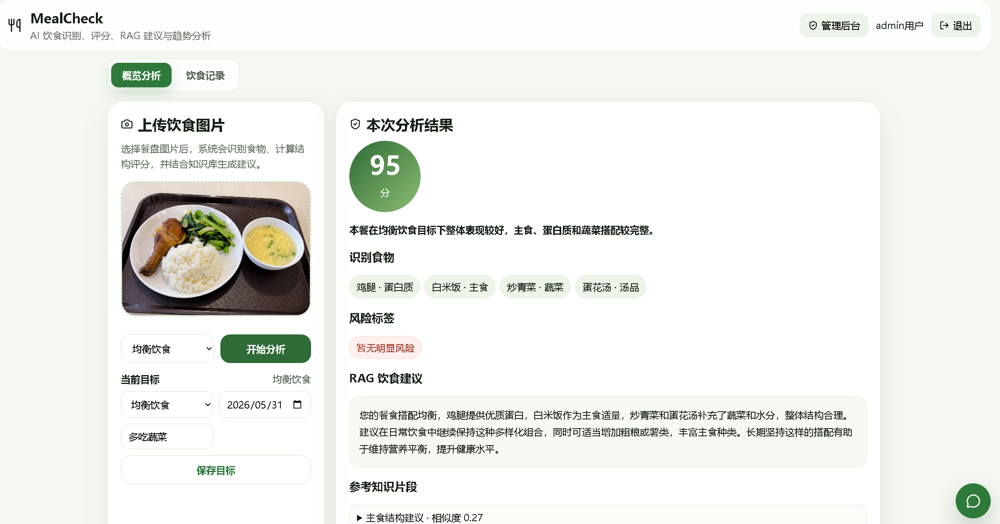
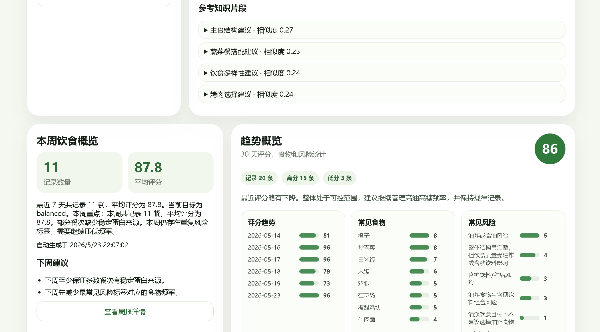
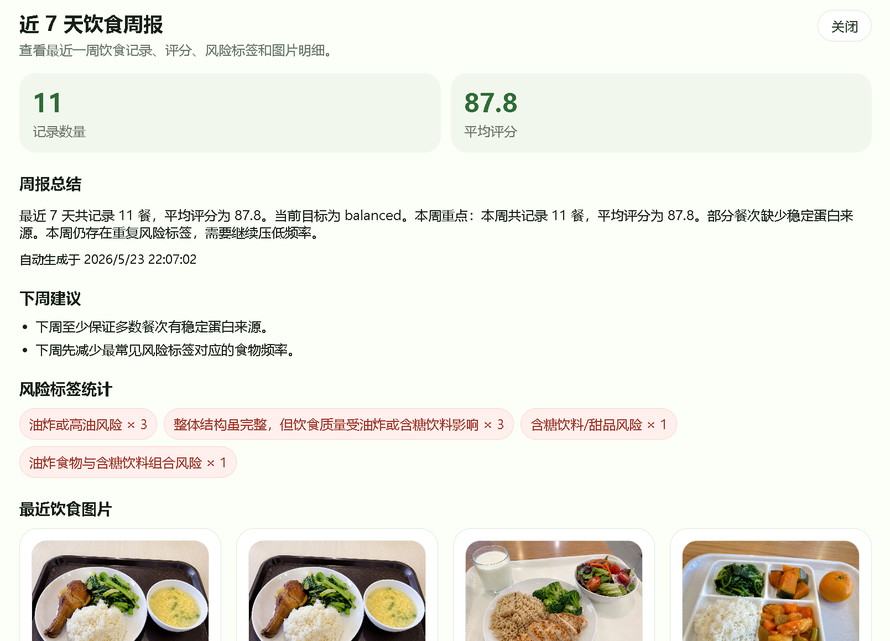

### admin

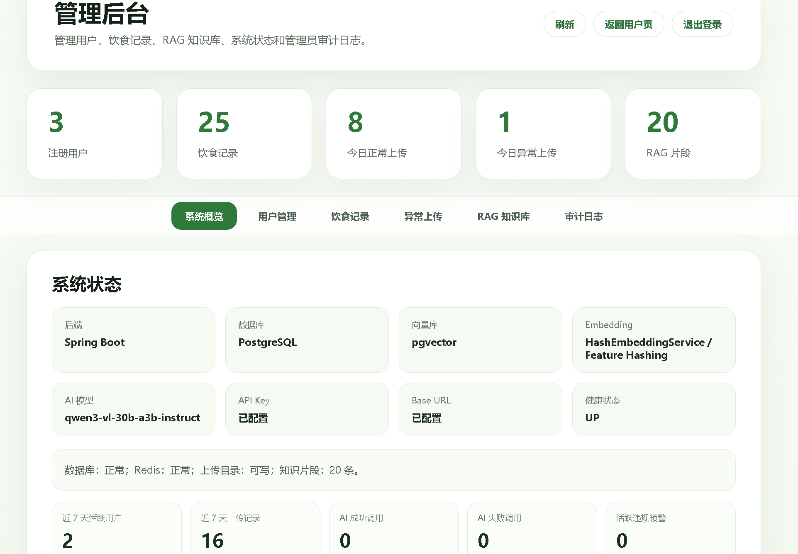
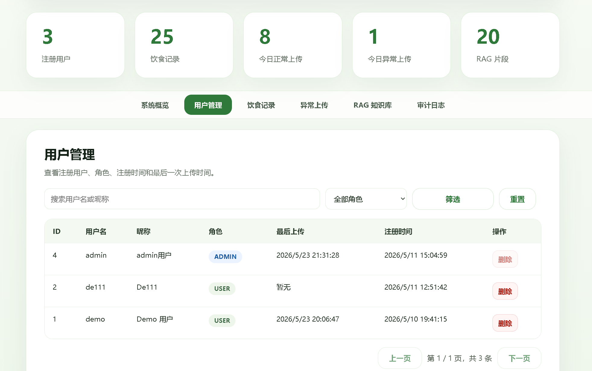
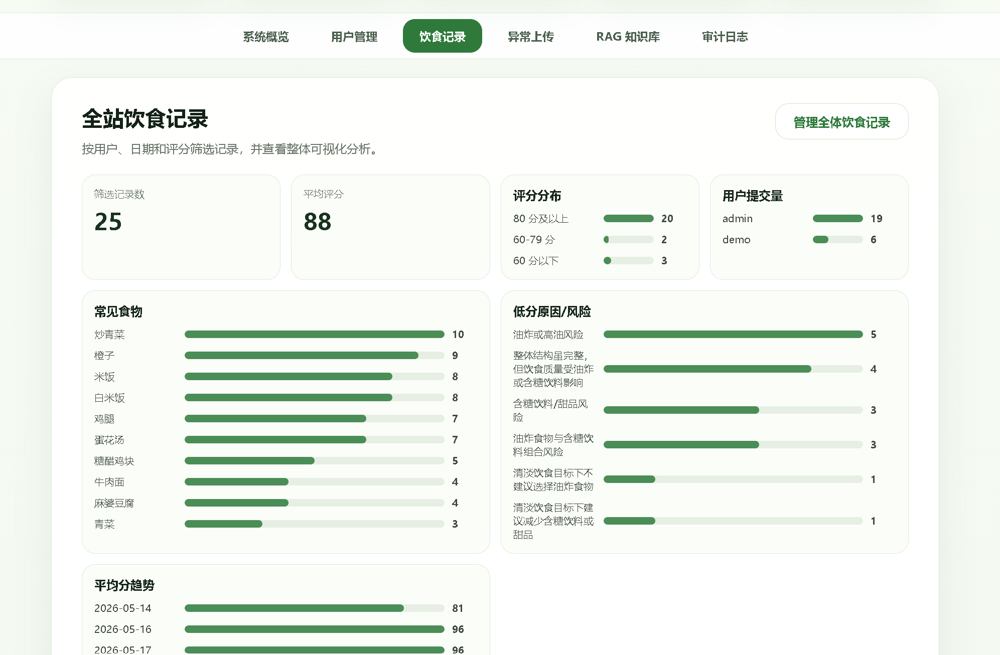
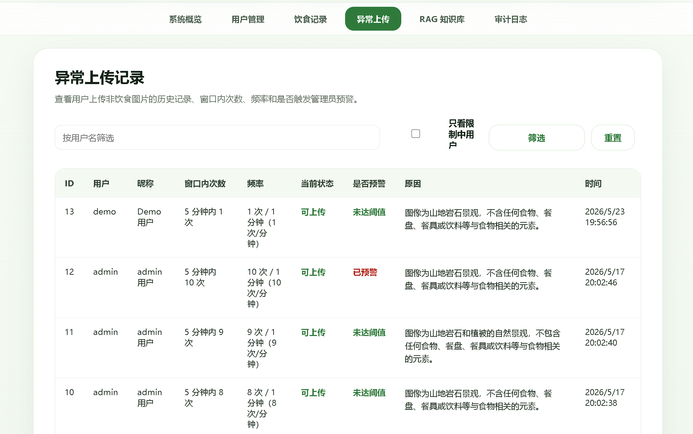
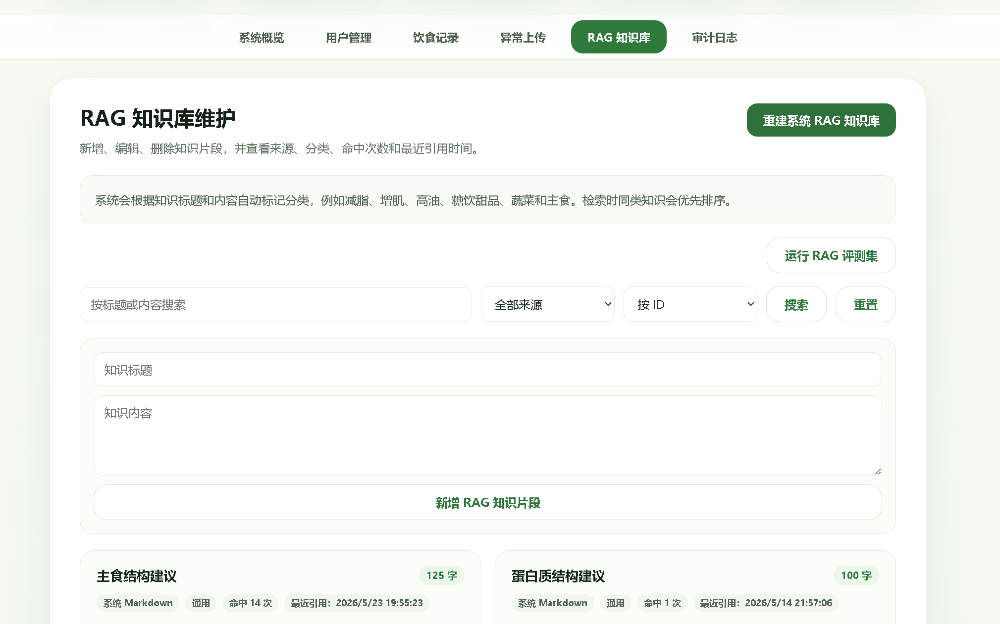
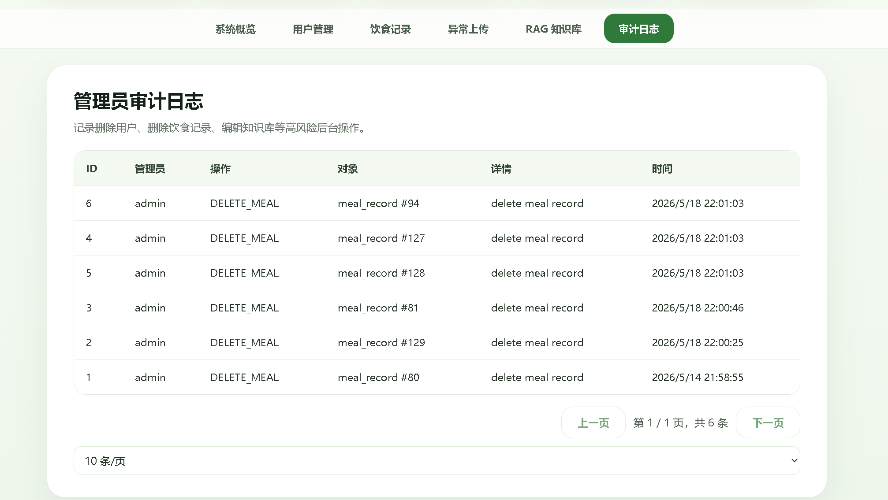

### assistant

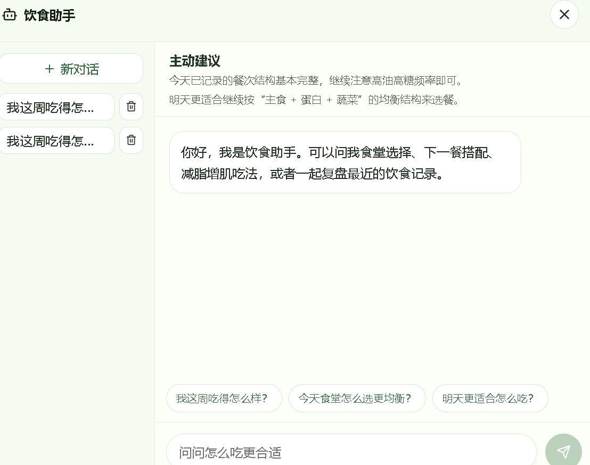
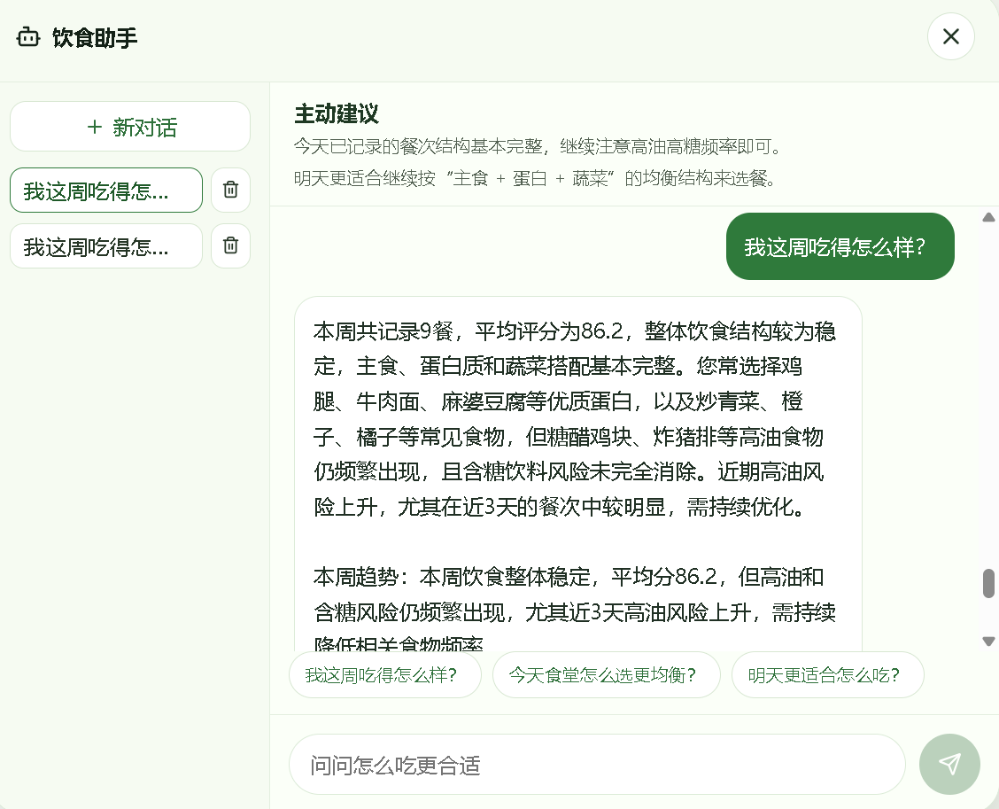
