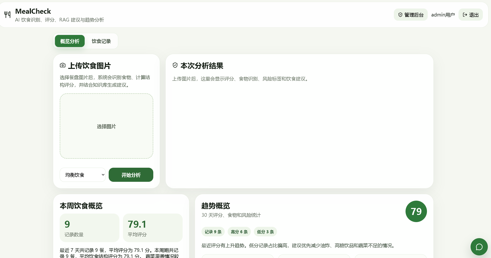
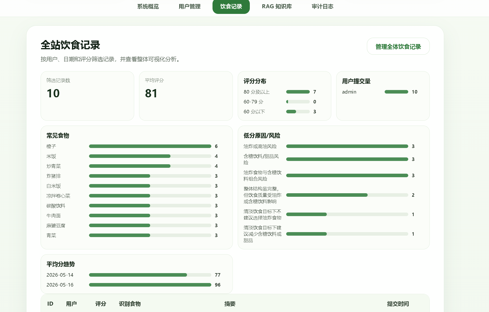
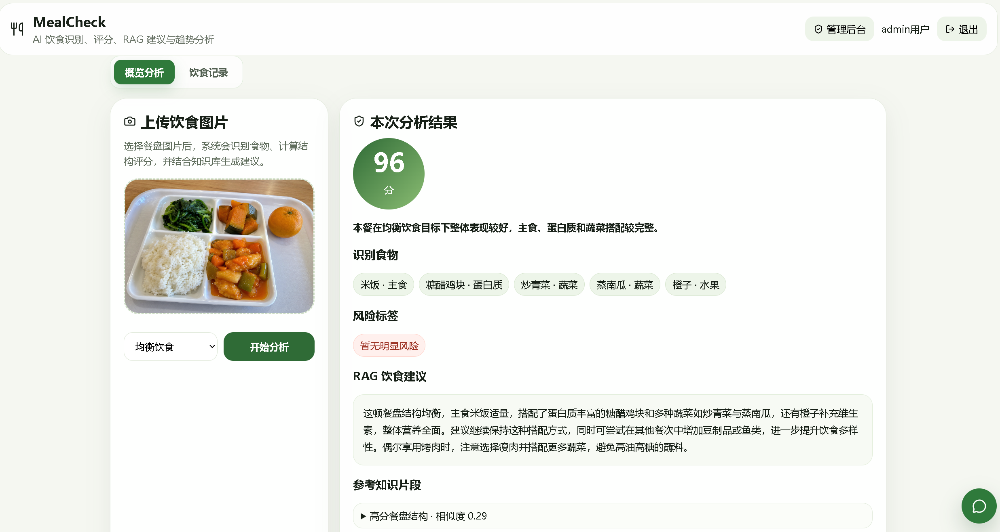

# MealCheck Fullstack

MealCheck is a meal image analysis system. Users can upload meal photos, get food recognition results, receive nutrition scores, and view RAG-based dietary suggestions. Administrators can manage users, meal records, and the RAG knowledge base.

## Tech Stack

- Backend: Spring Boot
- Database: PostgreSQL
- Vector Search: pgvector
- Authentication: JWT
- AI: Qwen VL API
- Knowledge Base: Markdown + RAG retrieval

## Features

- User registration, login, and JWT authentication
- Meal image upload and food recognition
- Meal structure scoring and risk tag analysis
- RAG-based nutrition advice
- Meal history and weekly reports
- Admin dashboard
  - User management
  - Global meal record pagination, filtering, deletion, and visual analytics
  - RAG knowledge creation, editing, deletion, search, rebuild, and hit statistics

## New in This Version

Compared with the previous project version, [MealCheck-agent](https://github.com/Lan-lan-123/MealCheck-agent), this version adds the following modules and capabilities:

- Intelligent diet assistant module
  - Added `LangChainDietAssistantService` and assistant-related DTOs/controllers
  - Supports structured RAG responses with `summary`, `suggestions`, `references`, and `riskLevel`
  - Supports multi-turn conversation context and user-specific assistant memory
- Redis-based infrastructure
  - Added Redis integration for short-term assistant context, RAG retrieval cache, admin statistics cache, token blacklist, and API rate limiting
- User diet profile and trend analysis
  - Added `UserDietProfile` persistence and profile services
  - Added user meal trend statistics, 30-day overview, and richer weekly report support

## Project Structure

```text
mealcheck-fullstack/
  backend/              Spring Boot backend
  frontend/             React + Vite frontend
  docker-compose.yml    PostgreSQL + Redis + optional full-stack services
  .env.example          Environment variable example
```

## Quick Start

### 1. Start only infrastructure services for local development

```bash
docker compose up -d
```

This starts only:

- PostgreSQL + pgvector
- Redis

### 2. Start the backend

```bash
cd backend
mvn spring-boot:run
```

Default backend URL:

```text
http://localhost:8080
```

### 3. Start the frontend

```bash
cd frontend
npm install
npm run dev
```

Default frontend URL:

```text
http://localhost:5173
```

### Optional: start the whole stack with Docker

```bash
docker compose --profile fullstack up --build -d
```

This starts PostgreSQL, Redis, backend, and frontend together.

## Environment Variables

```text
SPRING_DATASOURCE_URL=jdbc:postgresql://localhost:5432/mealcheck
SPRING_DATASOURCE_USERNAME=mealcheck
SPRING_DATASOURCE_PASSWORD=mealcheck123
MEALCHECK_AI_API_KEY=your_api_key
MEALCHECK_AI_BASE_URL=https://example.com/compatible-mode/v1/chat/completions
MEALCHECK_AI_MODEL=qwen3-vl
```

## Notes

- If the AI API key is not configured, the system can fall back to local demo recognition logic.
- The default RAG source is `backend/src/main/resources/knowledge/diet_guides.md`.
- RAG entries manually added by administrators are stored in the database and preserved separately.

## Pictures

### user 



### admin



### demo

