# MealCheck Fullstack

MealCheck is a meal image analysis system. Users can upload meal photos, get food recognition results, receive nutrition scores, and view RAG-based dietary suggestions. In addition, users can interact with an AI assistant powered by LangChain4j and RAG to receive personalized dietary advice. Administrators can manage users, meal records, and the RAG knowledge base.

## Tech Stack

- Backend: Spring Boot
- Frontend: React + Vite
- Database: PostgreSQL
- Vector Search: pgvector
- Cache & Session: Redis
- Authentication: JWT
- AI Vision: Qwen VL API
- AI Assistant: LangChain4j + RAG + optional Function Calling
- Weekly Report Multi-Agent: LangGraph4j orchestration + LangChain4j agents
- Knowledge Base: Markdown + pgvector Retrieval
- Agent Workflow: Tool orchestration, conversation memory, proactive suggestions
- Agent Skills: independently registered and dynamically selected diet skills
- MCP: authenticated Streamable HTTP tools for external AI clients
- Deployment: Docker Compose

## Features

- User registration, login, and JWT authentication
- Meal image upload and food recognition
- Meal structure scoring and risk tag analysis
- RAG-based nutrition advice
- AI Assistant: LangChain4j + RAG
  - Provides personalized diet Q&A based on user meal history and nutrition knowledge
  - Supports conversation context, RAG references, and structured responses
  - Generates proactive suggestions based on recent diet trends
  - Dynamically selects a registered skill for weekly reports, trend analysis, fat loss, muscle gain, fried food, barbecue, vegetables, sweet drinks, or balanced diet advice
  - Uses layered memory with full PostgreSQL history, conversation-scoped Redis working memory, rolling summaries, structured state, and token-budgeted relevant history
  - Optionally lets the model select read-only local tools through LangChain4j Function Calling, with bounded rounds, an allow-list, a request deadline, and deterministic fallback
- MCP server
  - Exposes read-only dietary knowledge, Skill routing, recent meal, and weekly report tools at `/mcp`
  - Reuses the existing JWT authentication and records per-tool request count, outcome, and latency
- Meal history and weekly reports
  - Uses a LangGraph4j workflow for generated reports: trend Agent and RAG evidence run in parallel, then a diet-plan Agent produces the draft and a safety-review Agent approves or requests one revision.
  - Keeps database/RAG access as deterministic tool nodes instead of treating every service as an Agent.
  - Falls back to the original rule-based report when AI is unavailable, the graph fails, or the final review still rejects the draft.
  - Returns `generationMode`, `reviewStatus`, and `agentTrace` metadata with each generated report for debugging and demonstrations.
- Admin dashboard
  - User management
  - Global meal record pagination, filtering, deletion, and visual analytics
  - RAG knowledge creation, editing, deletion, search, rebuild, and hit statistics
  - AI assistant usage statistics, question trends, RAG reference ranking, and session analytics

## New in This Version

Compared with the previous project version, [MealCheck-agent2](https://github.com/Lan-lan-123/MealCheck-agent2), this version mainly improves the AI Assistant module and adds more detailed user-side and admin-side capabilities:

- Enhanced AI Assistant
  - Improved the LangChain4j + RAG based diet assistant with structured responses, reference display, conversation context, and personalized suggestions.
  - Added assistant usage statistics, RAG reference tracking, session analytics, and proactive diet advice.

- Improved user-side features
  - Added richer diet trend analysis, user goal/profile management, weekly report generation, and clearer upload feedback.
  - Added abnormal upload handling for non-food images, including user warnings and temporary upload restrictions.

- Enhanced admin dashboard
  - Added more detailed user, meal record, RAG knowledge base, assistant usage, abnormal upload, and system operation statistics.
  - Improved pagination, filtering, deletion confirmation, visual analytics, RAG evaluation, and AI observability panels.

## Project Structure

```text
mealcheck-fullstack/
  backend/              Spring Boot backend
  frontend/             React + Vite frontend
  docker-compose.yml    PostgreSQL + Redis + optional full-stack services
  .env.example          Environment variable example
```

## Quick Start

### 1. Start only infrastructure services for local development

```bash
docker compose up -d
```

This starts only:

- PostgreSQL + pgvector
- Redis

### 2. Start the backend

```bash
cd backend
mvn spring-boot:run
```

Default backend URL:

```text
http://localhost:8080
```

### 3. Start the frontend

```bash
cd frontend
npm install
npm run dev
```

Default frontend URL:

```text
http://localhost:5173
```

### Optional: start the whole stack with Docker

```bash
docker compose --profile fullstack up --build -d
```

This starts PostgreSQL, Redis, backend, and frontend together.

## Environment Variables

```text
SPRING_DATASOURCE_URL=jdbc:postgresql://localhost:5432/mealcheck
SPRING_DATASOURCE_USERNAME=mealcheck
SPRING_DATASOURCE_PASSWORD=mealcheck123
MEALCHECK_AI_API_KEY=your_api_key
MEALCHECK_AI_BASE_URL=https://example.com/compatible-mode/v1/chat/completions
MEALCHECK_AI_MODEL=qwen3-vl
MEALCHECK_KNOWLEDGE_EMBEDDING_API_KEY=your_embedding_api_key
MEALCHECK_KNOWLEDGE_EMBEDDING_BASE_URL=https://example.com/compatible-mode/v1
MEALCHECK_KNOWLEDGE_EMBEDDING_MODEL=text-embedding-v4
MEALCHECK_KNOWLEDGE_EMBEDDING_DIM=512
MEALCHECK_KNOWLEDGE_VECTOR_STORAGE=halfvec
MEALCHECK_KNOWLEDGE_RERANK_ENABLED=false
MEALCHECK_KNOWLEDGE_RERANK_URL=https://api.jina.ai/v1/rerank
MEALCHECK_KNOWLEDGE_RERANK_API_KEY=your_rerank_api_key
MEALCHECK_KNOWLEDGE_RERANK_MODEL=jina-reranker-v2-base-multilingual
MEALCHECK_KNOWLEDGE_RERANK_CANDIDATE_MULTIPLIER=4
MEALCHECK_KNOWLEDGE_RERANK_MODEL_WEIGHT=0.75
MEALCHECK_KNOWLEDGE_RERANKER_MIN_SCORE=0.20
MEALCHECK_KNOWLEDGE_RRF_K=60
MEALCHECK_KNOWLEDGE_RESULT_FILTER_ENABLED=true
MEALCHECK_KNOWLEDGE_RESULT_MIN_SCORE=0.35
MEALCHECK_KNOWLEDGE_RESULT_RELATIVE_SCORE=0.60
MEALCHECK_KNOWLEDGE_RESULT_DEDUP_SIMILARITY=0.88
MEALCHECK_KNOWLEDGE_RESULT_CANDIDATE_MULTIPLIER=4
MEALCHECK_KNOWLEDGE_CHUNK_MIN_TOKENS=300
MEALCHECK_KNOWLEDGE_CHUNK_MAX_TOKENS=500
MEALCHECK_KNOWLEDGE_CHUNK_OVERLAP_TOKENS=50
MEALCHECK_KNOWLEDGE_SPLITTER_STRATEGY=recursive-markdown
MEALCHECK_KNOWLEDGE_SOURCE_VERSION=v2-recursive
MEALCHECK_MCP_ENABLED=true
MEALCHECK_MCP_ENDPOINT=/mcp
MEALCHECK_ASSISTANT_FUNCTION_CALLING_ENABLED=false
MEALCHECK_ASSISTANT_FUNCTION_CALLING_MAX_TOOL_ROUNDS=3
MEALCHECK_ASSISTANT_FUNCTION_CALLING_MAX_TOOL_CALLS=6
MEALCHECK_ASSISTANT_FUNCTION_CALLING_TOTAL_TIMEOUT_SECONDS=30
MEALCHECK_ASSISTANT_MEMORY_HISTORY_TOKEN_BUDGET=1200
MEALCHECK_ASSISTANT_MEMORY_RECENT_MESSAGES=6
MEALCHECK_ASSISTANT_MEMORY_SUMMARY_MAX_TOKENS=500
MEALCHECK_ASSISTANT_MEMORY_RELEVANT_MESSAGES=4
```

## Notes

- If the AI API key is not configured, the system can fall back to local demo recognition logic.
- The default RAG source is `backend/src/main/resources/knowledge/diet_guides.md`.
- Configure an OpenAI-compatible embedding endpoint for semantic retrieval. Without it, the system remains available through a local 512-dimensional hash embedding fallback.
- Existing fixed-dimension knowledge vectors are migrated to the configured dimension at startup and regenerated with the active embedding provider.
- Knowledge embeddings use pgvector `halfvec` storage by default. For 512 dimensions this reduces the raw vector payload from 2,056 bytes to 1,032 bytes (about 49.8%); set `MEALCHECK_KNOWLEDGE_VECTOR_STORAGE=vector` to keep 32-bit vectors.
- A same-dimension migration from `vector` to `halfvec` casts existing values without calling the embedding API again. A dimension change still regenerates embeddings to preserve correctness.
- Each knowledge vector stores an embedding signature. Switching between the hash fallback and a semantic model automatically refreshes stale vectors instead of mixing embedding spaces.
- Markdown knowledge uses the configurable `recursive-markdown` splitter by default: heading, paragraph, line, sentence, semicolon, comma, and finally token-window boundaries are tried in order. Chunks remain approximately 300-500 tokens with at least a 50-token overlap; the overlap expands only when needed to avoid an undersized tail chunk. Set `MEALCHECK_KNOWLEDGE_SPLITTER_STRATEGY=legacy-window` for the previous balanced-window behavior. The bundled guide currently produces 19 chunks, and each title plus body is embedded as one vector.
- Each chunk stores its source, category, source version, token count, update timestamps, stable chunk key, and SHA-256 content hash. Reindexing only regenerates vectors for new or changed chunks; unchanged chunks keep their existing vectors and hit statistics.
- RAG entries manually added by administrators are stored in the database and preserved separately.
- Hybrid retrieval independently ranks pgvector, title pg_trgm, and content pg_trgm candidates, then combines their ranks with weighted Reciprocal Rank Fusion (`k=60`) plus a small category prior. The normalized fusion score remains compatible with confidence metrics.
- Optional second-stage reranking expands Top-K weighted-RRF candidates by four and calls a query-document relevance model. Rough rank and reranker rank are fused with Weighted RRF; rough score/rank, raw reranker score/rank, and final score are retained separately. A timeout or provider failure automatically keeps the rough ranking.
- The 58-case admin RAG benchmark contains 48 answerable and 10 no-answer questions. It reports Hit@3, Hit@5, MRR, nDCG@5, category accuracy, no-answer accuracy, false-positive rate, layered scores, per-stage latency, and an automatic regression result.
- When reranking is active, candidates below `MEALCHECK_KNOWLEDGE_RERANKER_MIN_SCORE` are rejected before context injection; this raw-score threshold must be calibrated against the no-answer benchmark for the selected provider.
- Final RAG results use a configurable absolute score floor plus a relative-to-Top1 floor, then remove near-duplicate chunks with lexical Jaccard similarity before context injection.
- Assistant history remains intact in PostgreSQL. Redis keys include both username and conversation ID, preventing working-memory leakage between separate conversations.
- Normal assistant requests load a bounded recent PostgreSQL window and incrementally summarize at most 100 pending older messages, avoiding a full-history scan as conversations grow.
- Prompt memory is selected by token budget rather than a fixed message count: the most recent messages are retained, relevant older messages are selected, and evicted history is compressed into a rolling summary. Follow-up questions are expanded with the active conversation topic before RAG retrieval.
- Explicit user goals, preferences, allergies, and restrictions are stored as deduplicated long-term memory vectors. Recall combines semantic similarity, 90-day recency decay, and a same-conversation boost before facts enter the prompt.
- Recent meals, current goal, weekly report, RAG, and long-term memory are fetched concurrently with independent timeouts and graceful per-source fallback. DB, RAG, and background writes use separate fixed-size bounded executors; a request-wide deadline actively cancels timed-out tasks. Proactive advice reuses the already loaded meal records.
- Function Calling is disabled by default. When enabled, the model can select only four read-only tools: dietary knowledge search, recent meals, latest weekly report, and current goal. Model HTTP calls, DB tools, and RAG tools run in separate bounded pools; tool rounds, total tool calls, arguments, result sizes, and the end-to-end deadline are bounded. Any failure returns to the existing deterministic orchestration path.
- RAG and admin-stat caches use jittered TTLs and single-flight refresh. Empty RAG results receive a shorter TTL, while a stale copy lets concurrent followers avoid stampeding the database or model provider during refresh.
- Weekly report generation reuses the durable database job/worker boundary. LangGraph4j manages the internal parallel branches and review loop, while LangChain4j performs the three role-specific model calls. The review loop is bounded by `MEALCHECK_WEEKLY_REPORT_MAX_REVIEW_REVISIONS`, and each Agent call has an independent `MEALCHECK_WEEKLY_REPORT_AGENT_TIMEOUT_SECONDS` timeout.
- Remote AI, embedding, and reranker calls use configurable exponential-backoff retry, circuit breaking, and semaphore concurrency isolation in addition to HTTP timeouts.
- Flyway owns the versioned relational schema and query indexes; Hibernate uses `ddl-auto=validate` instead of mutating production tables at startup. Runtime-configured pgvector/halfvec columns remain managed by their vector services.

## Observability

Spring Boot Actuator exposes health and application metrics:

```text
GET /actuator/health
GET /actuator/metrics
GET /actuator/prometheus
```

`health` is public, while `metrics` and `prometheus` require authentication. Responses include an `X-Request-ID`, and the same request ID is included in backend logs for correlation.

Custom metrics include:

- `mealcheck.knowledge.embedding.*`: embedding request count and latency by provider/outcome
- `mealcheck.knowledge.index.*`: incremental indexing duration, runs, and inserted/updated/unchanged/deleted chunk counts
- `mealcheck.rag.search.*`: RAG cache hit/miss, latency, result count, and top score
- `mealcheck.rag.filter.*`: candidate/output counts, threshold removals, duplicate removals, effective threshold, and empty-result rate
- `mealcheck.rag.score.*`: rough Top1, raw reranker Top1, final Top1, and whether reranking was applied
- `mealcheck.rate.limit.requests`: Redis token-bucket decisions by API scope and outcome
- `mealcheck.executor.*`: executor pool/queue saturation, rejection count, queue wait, and task duration
- `mealcheck.weekly.report.jobs`: durable weekly-report job success, failure, rejection, and stale-result count
- `mealcheck.rag.rerank.*`: reranker request count, outcome, latency, and candidate count
- `mealcheck.ai.call.*`: VLM/assistant API request count and latency by operation/outcome
- `mealcheck.weekly.report.generated`: weekly report success/failure count
- `mealcheck.mcp.tool.*`: MCP tool request count and latency by tool/outcome
- `mealcheck.assistant.memory.*`: selected message/token counts, summary updates, and follow-up rewrite counts
- `mealcheck.assistant.tool.*`: latency and outcome for each parallel assistant data source and long-term memory write

## MCP Tools

The MCP Streamable HTTP endpoint is `POST /mcp`. Send the same `Authorization: Bearer <JWT>` header used by the REST API. User-specific tools derive the user identity from that JWT; no `userId` argument is accepted.

- `search_diet_knowledge`: hybrid dietary knowledge retrieval
- `route_assistant_skill`: select a registered assistant Skill
- `list_assistant_skills`: list available Skills
- `get_my_recent_meals`: get the authenticated user's recent meals
- `get_my_weekly_report`: get the authenticated user's latest weekly report

## Function Calling and MCP

Set `MEALCHECK_ASSISTANT_FUNCTION_CALLING_ENABLED=true` to enable the learning/demo Function Calling path. The flow is:

```text
assistant request -> model receives tool schemas -> model returns tool_calls
-> MealCheck validates the allow-list and arguments -> local business service executes
-> tool result is appended to the conversation -> model returns strict JSON
```

The in-process assistant deliberately does not make an HTTP request to its own `/mcp` endpoint. Function Calling and the MCP server reuse the same underlying MealCheck services: Function Calling is the model-to-tool interaction inside this application, while MCP is the standardized boundary for external AI clients. This keeps the monolith efficient while still making the tools available to external MCP hosts.

## Pictures

### user 

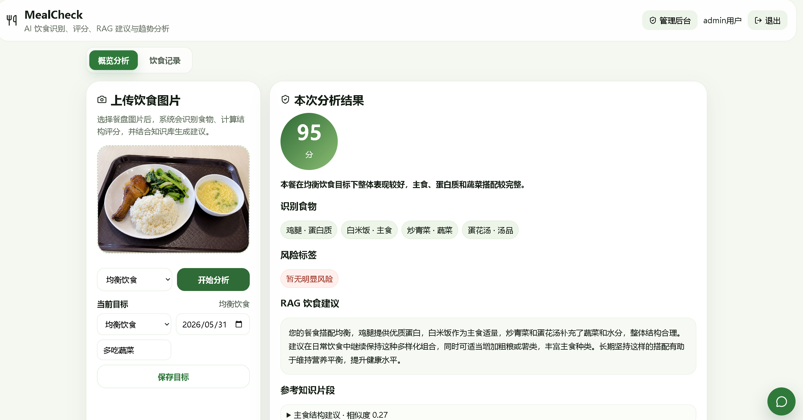
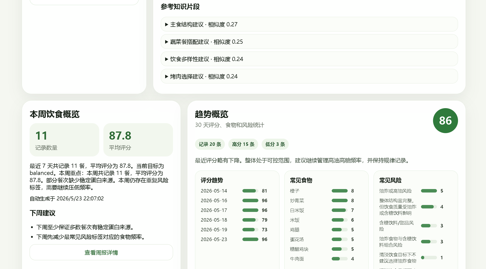
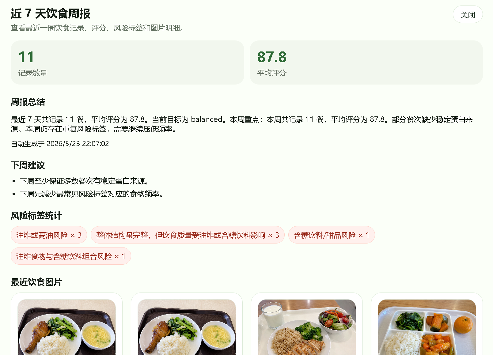

### admin

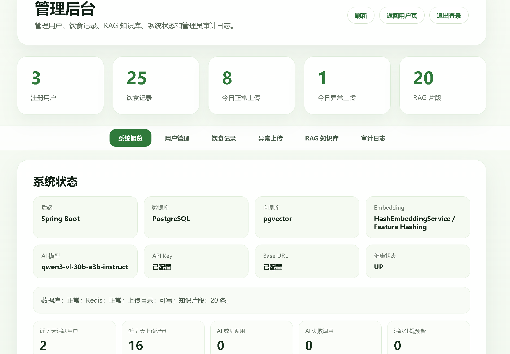
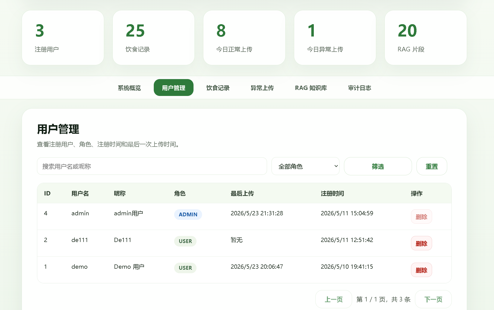
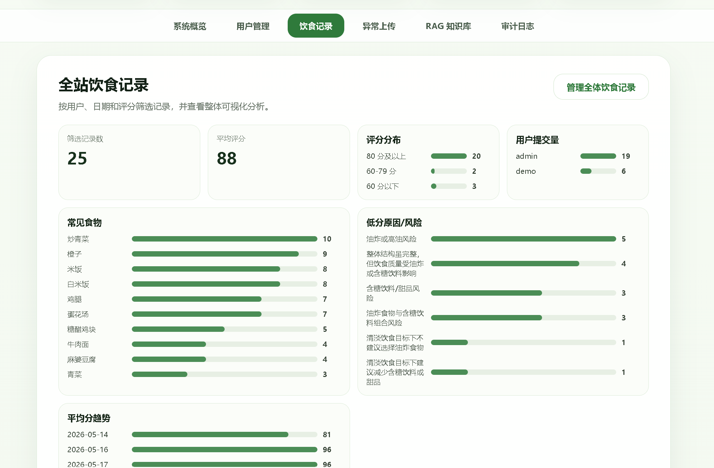
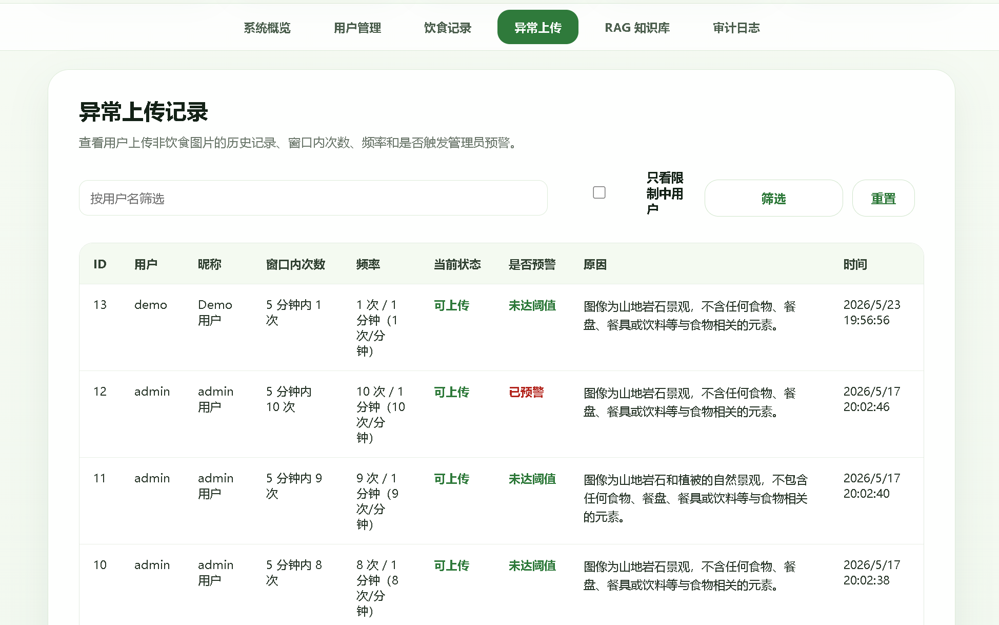
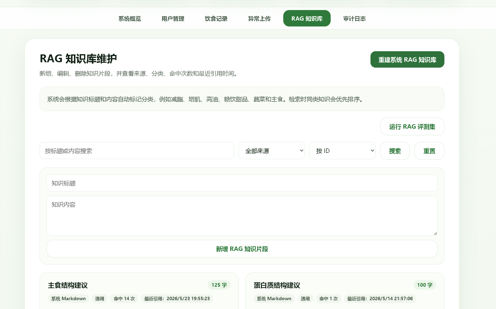
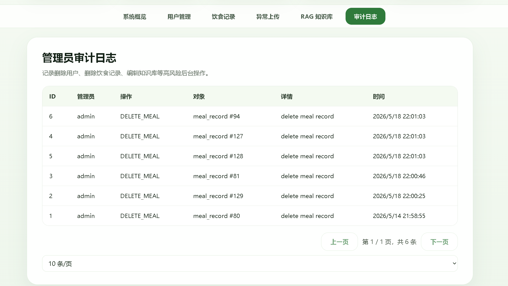

### assistant

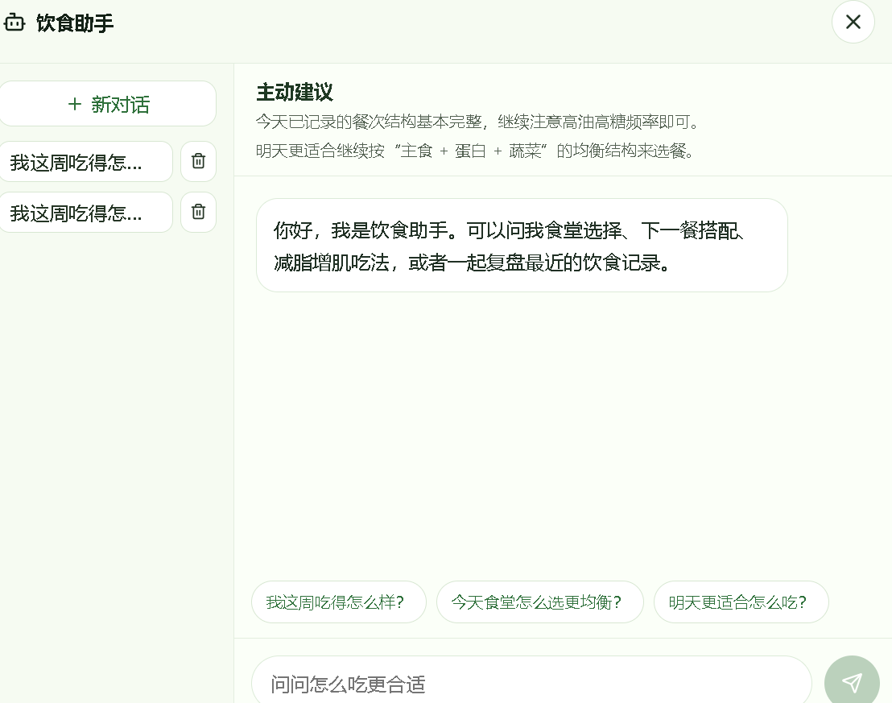
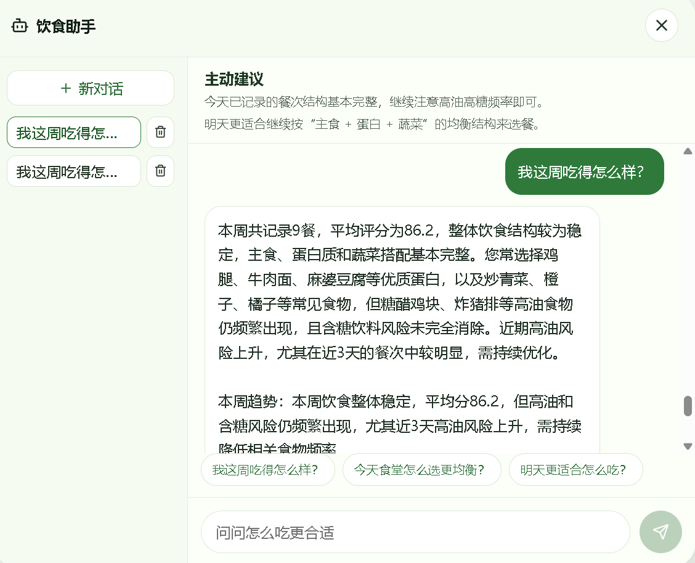
